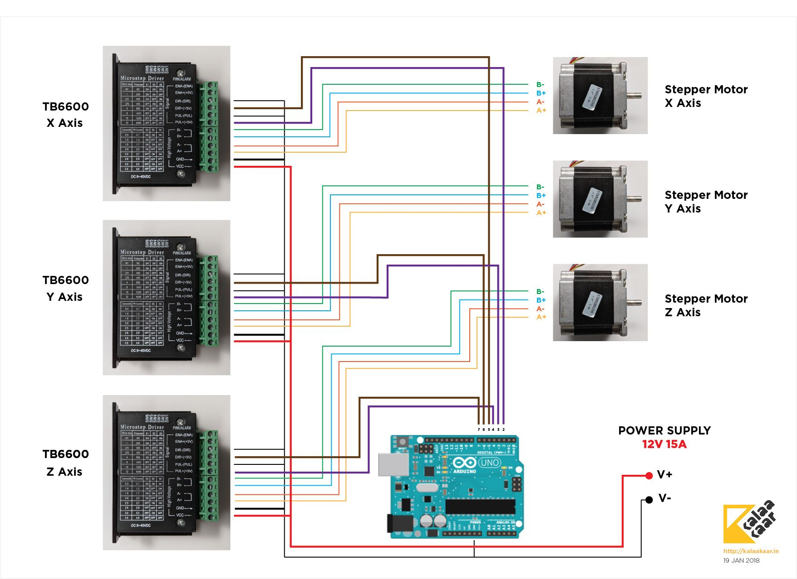

# axis
Stepper motor control using python and arduino.

## Installation 
1.  Clone this repository
    ```bash
    git clone https://github.com/calebsanfo/axis.git
    cd axis
    ```
2. Program Arduino - Run the Arduino IDE, open the arduinoController.ino file, and upload to Arduino board.

3. Install pyserial
    ```bash
    pip install pyserial
    ```

4. Install the python package
    ```bash
    python setup.py install
    ```

## Wiring
- X axis stepper driver on pins 2,3
- Y axis stepper driver on pins 4,5
- X axis stepper driver on pins 6,7
- Analog read on A0


(Image from http://coo.lari.yamida-yoga.de/tb6600-wiring-diagram.html)

## Usage
```python
import axis
a = axis.Axis("COM2") # change this to Arduino's COM port
print(a.get_x_pos())
a.set_xy_pos(100, 100)
print(a.get_x_pos())
print(a.get_analog_input())
```

## Calibration
- Adjust the STEPS_PER_MM parameter in the arduinoController code to calibrate the distance traveled. 